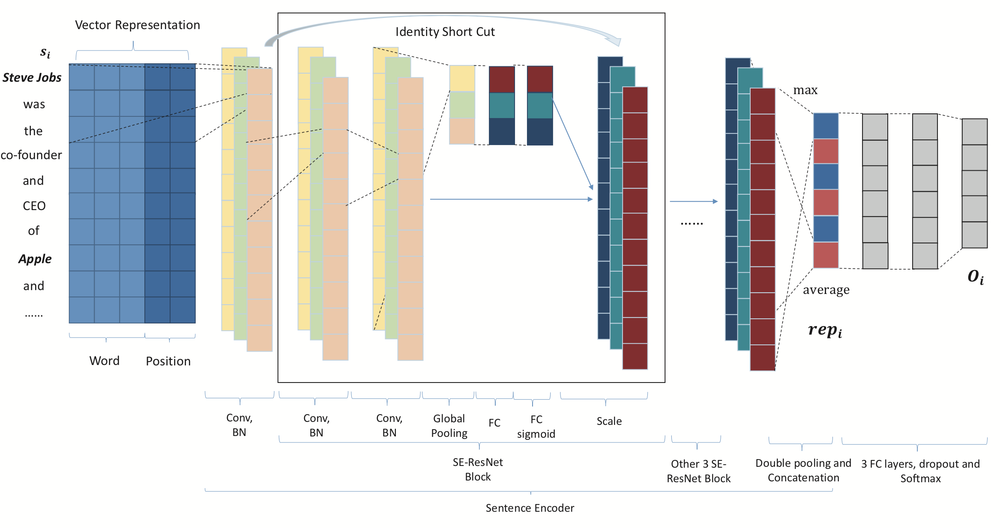

This is the implementation of my paper: SENet for Weakly-Supervised Realtion Extraction

Click here: [paper_draft](https://github.com/Theodoric008/SENet-for-Weakly-Supervised-Relation-Extraction/blob/master/paper_draft.pdf)

This paper is **SHIT** and wasn't accepted.

## How to train?
1. unzip zipfile in data/
2. put data folder at .. (recommend)
3. in cmd:
```bash
mkdir temp
python3 train.py
```

and test result will be saved to temp/


## How to eval?
```bash
python3 eval.py
```
## How to plot and compare with other models?
you need to fill in the pkl file path in plot script, and run
```bash
cd plot/
python3 baselins.py
python3 metric.py
```
## Model structure

## Best result(epoch ~= 170)

## About me:
A student in PRIS, BUPT. 

## Prerequist
1. Tensorflow-gpu==1.4.0
2. sklearn, tflearn, nltk, numpy; update to date
3. Python >= 3.6.5

## Acks
I did NOT write these from scratch. I cloned this repo: [ResCNN-9](https://github.com/darrenyaoyao/ResCNN_RelationExtraction) and improve it.
